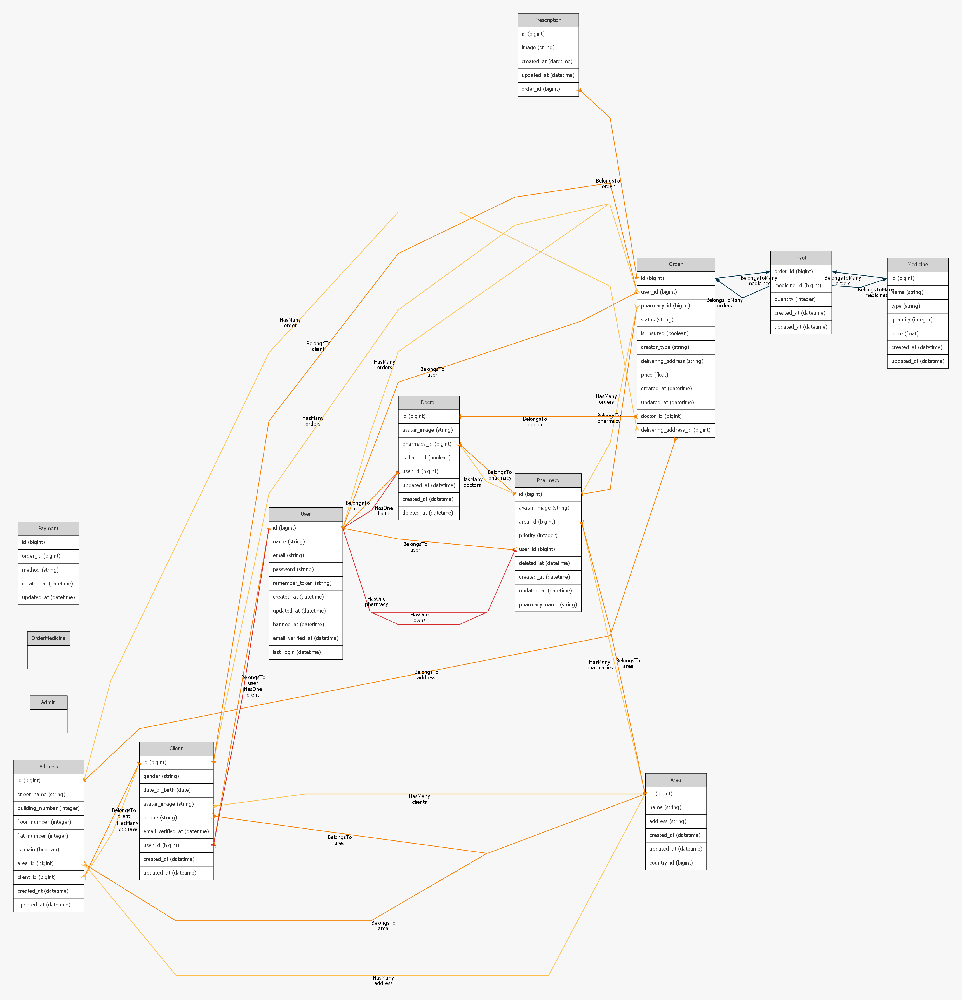

# Pharmacy Management System

A Laravel-based Pharmacy Management System for managing pharmacies, doctors, clients, medicines, prescriptions, orders, payments, areas, and revenue reporting from one web dashboard.

The system is designed around four user roles: **Admin**, **Pharmacy**, **Doctor**, and **Client**. Admin users manage the whole platform, pharmacy users manage pharmacy-related operations, doctors manage assigned orders, and clients can register, manage addresses, and place orders through the API.



## Table of Contents

- [Features](#features)
- [Tech Stack](#tech-stack)
- [User Roles](#user-roles)
- [Requirements](#requirements)
- [Installation](#installation)
- [Running the Project](#running-the-project)
- [Default Admin Login](#default-admin-login)
- [API Endpoints](#api-endpoints)
- [Project Structure](#project-structure)
- [Database Setup](#database-setup)
- [Useful Commands](#useful-commands)
- [Troubleshooting](#troubleshooting)
- [Authors](#authors)

## Features

- User authentication and email verification
- Role and permission management
- Admin, pharmacy, doctor, and client dashboards
- Pharmacy management
- Doctor management with ban and unban actions
- Client and address management
- Medicine management
- Order creation, tracking, confirmation, and status updates
- Prescription support
- Stripe payment integration
- Revenue reports for pharmacies
- Chart-based order statistics
- Country and area management
- REST API for client registration, login, addresses, and orders
- Excel/DataTable support for reporting

## Tech Stack

- **Backend:** Laravel 9, PHP 8
- **Frontend:** Blade, Bootstrap, Sass, JavaScript, jQuery
- **Build Tool:** Vite
- **Database:** SQLite or MySQL
- **Authentication:** Laravel UI, Laravel Sanctum
- **Permissions:** Spatie Laravel Permission
- **Payments:** Stripe PHP SDK
- **Tables/Reports:** Yajra DataTables, Laravel Excel
- **Email:** Laravel Mail / SMTP

## User Roles

| Role | Description |
| --- | --- |
| Admin | Full access to users, pharmacies, doctors, clients, medicines, areas, orders, and reports. |
| Pharmacy | Manages pharmacy profile, doctors, orders, and revenue information. |
| Doctor | Views and manages assigned prescription/order workflows. |
| Client | Registers, verifies email, manages addresses, and creates orders through the API. |

## Requirements

Make sure these are installed and enabled:

- PHP `^8.0.2`
- Composer
- Node.js and npm
- SQLite or MySQL
- PHP extensions:
  - `openssl`
  - `pdo`
  - `pdo_sqlite` or `pdo_mysql`
  - `mbstring`
  - `fileinfo`
  - `gd`
  - `zip`
  - `curl`

> If you are using XAMPP on Windows, enable `extension=gd` and `extension=zip` in `C:\xampp\php\php.ini`.

## Installation

Clone the repository:

```bash
git clone https://github.com/checkinn71-lab/Pharmacy-Management-System.git
cd Pharmacy-Management-System
```

Install PHP dependencies:

```bash
composer install
```

Install JavaScript dependencies:

```bash
npm install
```

Create the environment file:

```bash
cp .env.example .env
```

Generate the application key:

```bash
php artisan key:generate
```

## Database Setup

### Option 1: SQLite

Update `.env`:

```env
DB_CONNECTION=sqlite
```

Create the SQLite database file:

```bash
touch database/database.sqlite
```

On Windows PowerShell:

```powershell
New-Item -ItemType File database/database.sqlite
```

Run migrations and seeders:

```bash
php artisan migrate --seed
```

### Option 2: MySQL

Create a MySQL database and update `.env`:

```env
DB_CONNECTION=mysql
DB_HOST=127.0.0.1
DB_PORT=3306
DB_DATABASE=pharmacy_management_system
DB_USERNAME=root
DB_PASSWORD=
```

Run migrations and seeders:

```bash
php artisan migrate --seed
```

Create the storage symbolic link:

```bash
php artisan storage:link
```

## Running the Project

Start the Laravel development server:

```bash
php artisan serve
```

Start the Vite development server in another terminal:

```bash
npm run dev
```

Open the application:

```text
http://127.0.0.1:8000
```

For production-ready frontend assets:

```bash
npm run build
```

## Default Admin Login

After running the seeders, use:

```text
Email: admin@gmail.com
Password: 123456
```

You can also create another admin user:

```bash
php artisan create:admin --name="Admin" --email="admin@example.com" --password="your-password"
```

## API Endpoints

Base API URL:

```text
http://127.0.0.1:8000/api
```

### Authentication

| Method | Endpoint | Description |
| --- | --- | --- |
| POST | `/register` | Register a new client account |
| POST | `/login` | Login and generate an API token |
| GET | `/email/resend/{id}` | Resend verification email |
| GET | `/user` | Get authenticated user details |

### Client

These routes require Sanctum authentication and verified email.

| Method | Endpoint | Description |
| --- | --- | --- |
| GET | `/client/{id}` | Get client profile |
| PUT | `/client/{id}` | Update client profile |

### Address

These routes require Sanctum authentication and verified email.

| Method | Endpoint | Description |
| --- | --- | --- |
| GET | `/address` | Get all addresses |
| GET | `/address/{id}` | Get one address |
| POST | `/address` | Create a new address |
| PUT | `/address/{id}` | Update an address |
| DELETE | `/address/{id}` | Delete an address |

### Orders

These routes require Sanctum authentication and verified email.

| Method | Endpoint | Description |
| --- | --- | --- |
| GET | `/orders` | Get client orders |
| GET | `/orders/{id}` | Get one order |
| POST | `/orders` | Create a new order |
| PUT | `/orders/{id}` | Update an order |

## Web Routes Overview

| Module | Main Routes |
| --- | --- |
| Dashboard | `/`, `/home` |
| Medicines | `/medicines` |
| Orders | `/orders` |
| Doctors | `/doctors` |
| Pharmacies | `/pharmacies` |
| Areas | `/areas` |
| Clients | `/clients` |
| Addresses | `/addresses` |
| Revenue | `/revenue` |
| Stripe Payment | `/stripe/{id}` |

## Project Structure

```text
app/                 Application models, controllers, middleware, commands
bootstrap/           Laravel bootstrap files
config/              Application configuration
database/            Migrations, factories, seeders, SQLite database file
public/              Public assets and entry point
resources/           Blade views, Sass, JavaScript assets
routes/              Web and API route definitions
storage/             Logs, cache, file uploads
tests/               Feature and unit tests
```

## Useful Commands

Run migrations:

```bash
php artisan migrate
```

Refresh database and seed again:

```bash
php artisan migrate:fresh --seed
```

Run seeders only:

```bash
php artisan db:seed
```

Clear Laravel cache:

```bash
php artisan optimize:clear
```

Run tests:

```bash
php artisan test
```

Start Laravel scheduler:

```bash
php artisan schedule:work
```

## Environment Configuration

Important `.env` values:

```env
APP_NAME="Pharmacy Management System"
APP_ENV=local
APP_DEBUG=true
APP_URL=http://127.0.0.1:8000

DB_CONNECTION=sqlite

MAIL_MAILER=smtp
MAIL_HOST=sandbox.smtp.mailtrap.io
MAIL_PORT=2525
MAIL_USERNAME=
MAIL_PASSWORD=
MAIL_ENCRYPTION=tls
MAIL_FROM_ADDRESS="pharmacy@example.com"
MAIL_FROM_NAME="Pharmacy Management System"
```

Configure Stripe keys if payment features are used:

```env
STRIPE_KEY=
STRIPE_SECRET=
```

## Troubleshooting

### `php` is not recognized on Windows

Use the full XAMPP PHP path:

```powershell
C:\xampp\php\php.exe artisan serve
```

Or add `C:\xampp\php` to your system `PATH`.

### Missing `gd` or `zip` extension

Open `C:\xampp\php\php.ini` and uncomment:

```ini
extension=gd
extension=zip
```

Restart the terminal after saving.

### SQLite file is not a database

Delete the invalid SQLite file, recreate it, then migrate again:

```bash
rm database/database.sqlite
touch database/database.sqlite
php artisan migrate:fresh --seed
```

### Frontend assets are missing

Run:

```bash
npm install
npm run dev
```

Or build static assets:

```bash
npm run build
```

## Screenshots / Diagrams

Entity relationship diagrams are included in the repository:

- `erd.png`
- `pharmacyERD.png`

## Authors

- [Hager Abd El Galil](https://github.com/Hager-Abd-El-Galil)
- [Mariam Reda Mokhtar](https://github.com/Mariam-Mokhtar)
- [Radwa Hassan](https://github.com/RadwaHassan99)
- [Rowan Tamer](https://github.com/rowantamer)
- [Omnia Goher](https://github.com/Omnia-Goher)

## Repository

GitHub:

```text
https://github.com/checkinn71-lab/Pharmacy-Management-System.git
```
# Medi_Track_System

# Medi_Track_System

